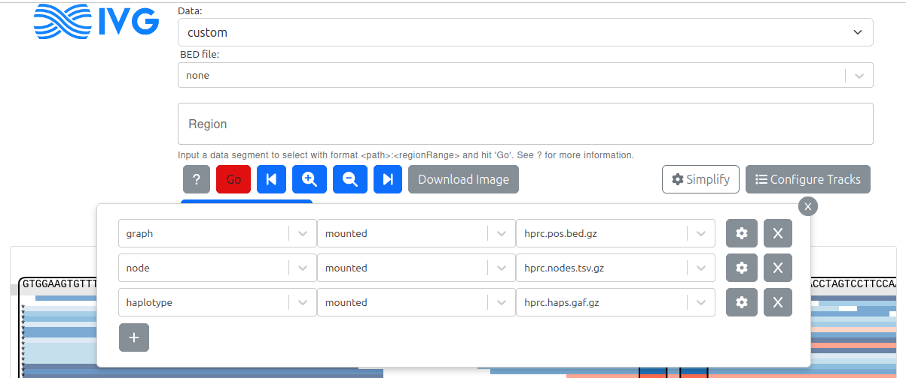
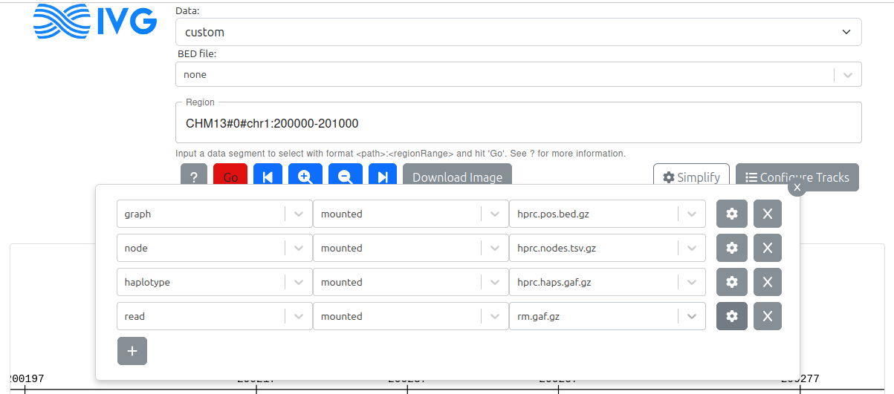
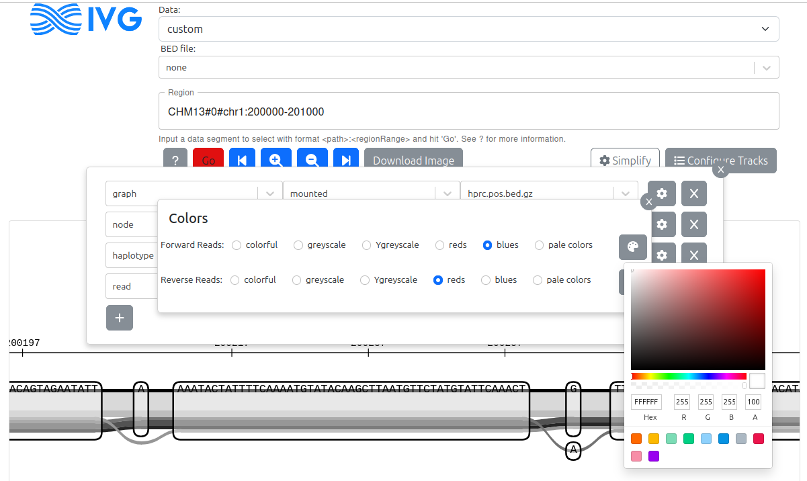

## Tabix-based index files

Three files are used, each one indexed with tabix (additional `.tbi` file):

1. `nodes.tsv.gz` contains the sequence of each node.
2. `pos.bed.gz` contains the position (as node intervals) of regions on each haplotype.
3. `haps.gaf.gz` contains the path followed by each haplotype (split in pieces).

Briefly, these three index files can be quickly queried to extract a subgraph covering a region of interest: the `pos.bed.gz` index can first tell us which nodes are covered, then the `nodes.tsv.gz` index gives us the sequence of these nodes, and finally we can stitch the haplotype pieces in those nodes from the `haps.gaf.gz` index.
This approach was implemented in a [`chunkix.py`](scripts/chunkix.py) script which can produce a GFA file or files used by the sequenceTubeMap. 
The sequenceTubeMap uses this script internally when given tabix-based index files.

## Using tabix-based index files in the sequenceTubeMap

The version on this `tabix` branch can use those index files, for example when mounted files are provided:

- the `pos.bed.gz` index in the *graph* field
- the `nodes.tsv.gz` index in the *node* field
- the `haps.gaf.gz` index in the *haplotype* field

---



---

Once the index files are mounted, one can query any region on any haplotype in the form *HAPNAME_CONTIG:START-END*.

Other tracks, for example reads or annotations in bgzipped/indexed GAF files, can be added as *reads* in the menu.

---



---

Of note, you can set a color for each track using the existing palettes or by picking a specific color.

---



---

## ~~Installation~~ Using the docker container

A docker container with this new sequenceTubeMap version, and all the dependencies necessary, is available at `quay.io/jmonlong/sequencetubemap:tabix_dev`.

To use it, run:

```sh
docker run -it -p 3210:3000 -v `pwd`:/data quay.io/jmonlong/sequencetubemap:tabix_dev
```

Of note, the `-p` option redirects port 3000 to 3210. 
In practice, pick an unused port.

Then open: http://localhost:3210/

Note: For mounted files, this assumes all files (pangenomes, reads, annotations) are in the current working directory or in subdirectories.
To test with the files that are already prepared, download all the files (see below). 
Then, either use them as *custom* Data adding the tracks with the *Configure Tracks* button, or use the prepared Data set "HPRC Minigraph-Cactus v1.1".
For info, the files for this Dataset were defined in the [config.json file](docker/config.json) used to build the docker.

## Available tabix-based index files for the Minigraph-Cactus v1.1 pangenome

Index files and some annotations have been deposited at https://public.gi.ucsc.edu/~jmonlong/sequencetubemap_tabix/

To download it all:

```
# pangenome index files
wget https://public.gi.ucsc.edu/~jmonlong/sequencetubemap_tabix/hprc.haps.gaf.gz
wget https://public.gi.ucsc.edu/~jmonlong/sequencetubemap_tabix/hprc.haps.gaf.gz.tbi
wget https://public.gi.ucsc.edu/~jmonlong/sequencetubemap_tabix/hprc.nodes.tsv.gz
wget https://public.gi.ucsc.edu/~jmonlong/sequencetubemap_tabix/hprc.nodes.tsv.gz.tbi
wget https://public.gi.ucsc.edu/~jmonlong/sequencetubemap_tabix/hprc.pos.bed.gz
wget https://public.gi.ucsc.edu/~jmonlong/sequencetubemap_tabix/hprc.pos.bed.gz.tbi

# annotation files
wget https://public.gi.ucsc.edu/~jmonlong/sequencetubemap_tabix/gene_exon.gaf.gz
wget https://public.gi.ucsc.edu/~jmonlong/sequencetubemap_tabix/gene_exon.gaf.gz.tbi
wget https://public.gi.ucsc.edu/~jmonlong/sequencetubemap_tabix/gwasCatalog.hprc-v1.1-mc-grch38.sorted.gaf.gz
wget https://public.gi.ucsc.edu/~jmonlong/sequencetubemap_tabix/gwasCatalog.hprc-v1.1-mc-grch38.sorted.gaf.gz.tbi
wget https://public.gi.ucsc.edu/~jmonlong/sequencetubemap_tabix/rm.gaf.gz
wget https://public.gi.ucsc.edu/~jmonlong/sequencetubemap_tabix/rm.gaf.gz.tbi
```

## Building tabix-based index files from a GFA

### Optional. Make a GFA from a GBZ file

In some cases, you will want to use exactly the same pangenome space as a specific GBZ file. 
For example, to visualize reads or annotation on that pangenome. 
The GFA provided in the HPRC repo might not match exactly because some nodes may have been split when making the GBZ file. 
You can convert a GBZ to a GFA (and not translate the nodes back to the original GFA) with:

```sh
vg convert --no-translation -f -t 4 hprc-v1.1-mc-grch38.gbz | gzip >  hprc-v1.1-mc-grch38.gfa.gz
```

### Run the `pgtabix.py` python script 

The `pgtabix.py` script can be found in the [`scripts` directory](scripts).
It's also present in the `/build/sequenceTubeMap/scripts` directory of the Docker container `quay.io/jmonlong/sequencetubemap:tabix_dev`.

```sh
python3 pgtabix.py -g hprc-v1.1-mc-grch38.gfa.gz -o output.prefix
```

It takes about 1h30-2h to build index files for the Minigraph-Cactus v1.1 pangenome.
This process should scale linearly with the number of haplotypes.

## Making your own annotation files

To make your own annotation files, we have developed a pipeline to project annotation files at the haplotype level (e.g. BED, GFF) onto a pangenome (e.g. GBZ). 
Once the projected GAF files are sorted, bgzipped and indexed, they can be queried fast, for example by sequenceTubeMap.

The pipeline is described in the [manuscript](https://jmonlong.github.io/manu-vggafannot/) and script/docs was deposited in [the GitHub repository](https://github.com/jmonlong/manu-vggafannot?tab=readme-ov-file). 
In particular, example on how annotation files were projected for this manuscript are described in [this section](https://github.com/jmonlong/manu-vggafannot/tree/main/analysis/annotate).
