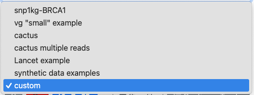
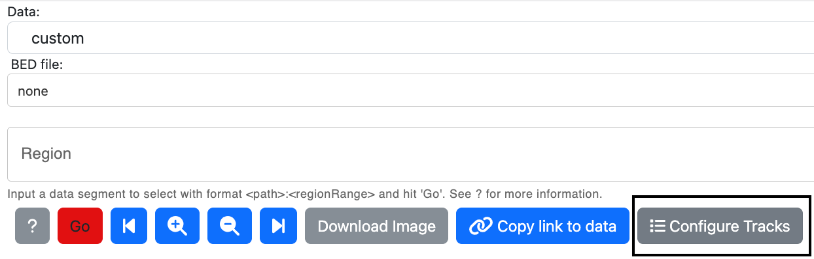
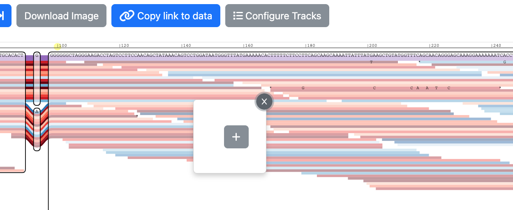
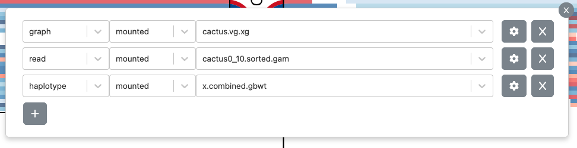
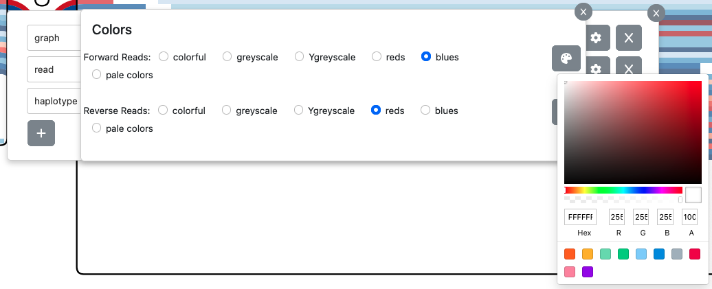
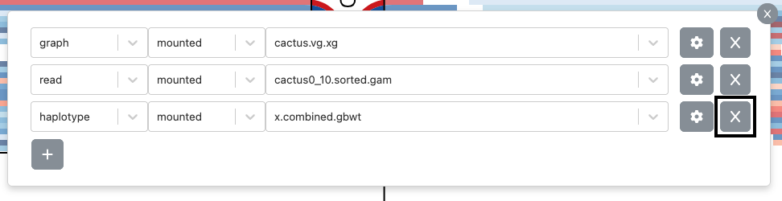
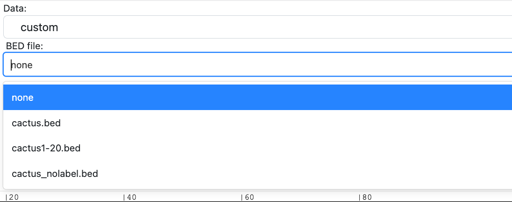
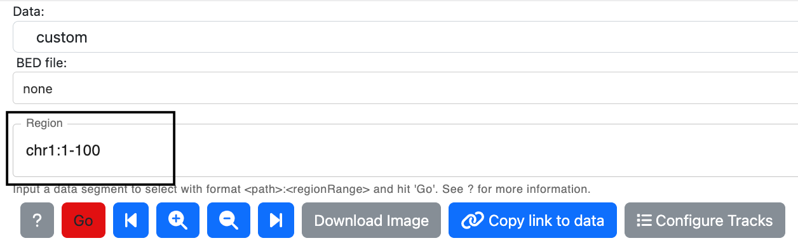
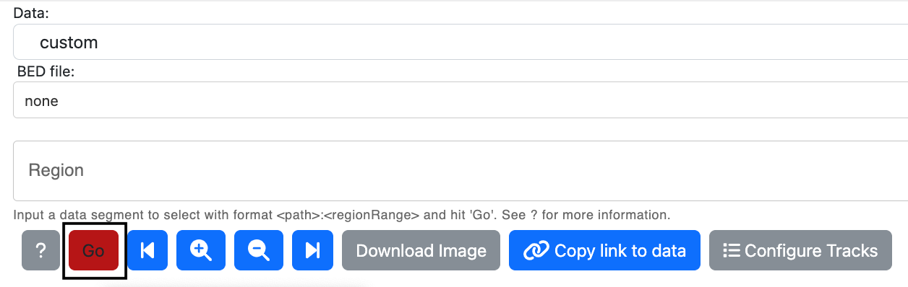

#### Sequence Tube Map Usage Guide
The Sequence Tube Map is used to generate visualizations of genomic sequence graphs. This guide will demonstrate how to select custom data to visualize. [You can also read this guide on Github.](https://github.com/vgteam/sequenceTubeMap/blob/master/public/help/help.md)


##### Selecting Tracks
The following procedure describes adding and updating settings of custom tracks. You can use a custom track to load your own graph file, haplotype database, or file of aligned reads.

1. From the "Data" dropdown box, select "custom"
  
2. Select the button that says "Configure Tracks".  

3. Once the button is clicked on, a popup with a "+" button will be displayed. Click on this button to add tracks.  
  
4. Select whether you want a graph, read, or haplotype track from the first dropdown. Make sure to always have at least 1 graph track. Select a data file from the list of files of that type in the last dropdown. In the default Tube Map configuration, these files come from the `exampleData/` folder on the system where the Tube Map server is running. If you want to upload a file instead of selecting one that's already available, change the middle dropdown to "upload". 

5. Click on the settings button, where there are options to color the tracks from an existing color palette, or select any other color.  
  
7. To delete a track, click on the button with the "x" icon.  


##### Displaying Visualizations
1. Add as many tracks as needed and exit the track picker. 
2. Add a BED file, if needed. This step is optional.

3. Specify a region input. The region input can be:
   * A coordinate range (e.g. "chr1:1-100")
   * A node ID range (e.g. "node:100-110")
   * A start position and a distance (e.g. "chr1:1+100")
   * A node ID anchor and a distance (e.g. "node:100+10")

4. If simplifying the BED file chunk or graph is possible, users will see a "Simplify Off" button, which when clicked with toggle to "Simplify On". This option enables vg simplify, which would remove small snarls. This option will only appear when there aren't any reads to be displayed. 
5. Click Go to see the selected tracks render in the visualization area.


##### How to make link-to-view URLs
Users can compose URLs that link to a specific view, or a visualization of genomic data. The link describes which tracks and files will be displayed. 

###### Query String Encoding
The link has a [query string](https://en.wikipedia.org/wiki/Query_string#Structure) that consists of key-value pairs separated by ampersands, where the keys are not URL-econded and the values are URL-encoded. 

Keys can use brackets to encode hierarchical structures such as arrays and objects. 
   * For arrays, put a number in brackets to assign a new value to or access a value in that entry in the array.
   * For objects, put the key's name in brackets to assign a new value to or access a value in that entry in the object. 

The key's name should **not** be in quotes.

Example of an array of JSON objects:

```json
[
   {
      "a": "b",
   }, 
   {
      "c": "d",
      "e": {
         "f": "g"
      }
   } 
]
```

This array's query string representation would be: `object[0][a]=b&object[1][c]=d&object[e][f]=g`.


###### Fields that can be included in the link URL:
1. `tracks` 

   Array of tracks. Tracks are objects consisting of `trackFile`, `trackType`, and `trackColorSettings`.

   A track object in JSON format might look like this:
   
   ```json
   {
      "trackFile": "exampleData/internal/snp1kg-BRCA1.vg.xg",
      "trackType": "graph",
      "trackColorSettings": {
         "mainPalette": "greys",
         "auxPalette": "ygreys",
         "colorReadsByMappingQuality": false
      }
   }
   ```

   The collection of tracks wil be encoded as query string parameters starting with tracks.

   * `trackFile`: the path (from the server working directory) or URL (any HTTP/HTTPS URL) to the track file. 
     * Examples:
         * File in server working directory: `tracks[0][trackFile]=exampleData/internal/snp1kg-BRCA1.vg.xg`.
         * HTTP/HTTPS URL: `tracks[0][trackFile]=https://public.gi.ucsc.edu/~anovak/graphs/trivial-brca1.vg`.
   * `trackType`: the type of the track, which can be `graph`, `haplotype`, `read`.
      * Example: `tracks[0][trackType]=graph`.
   * `trackColorSettings` (optional): the color information for the track. It has subfields:
      * `mainPalette` and `auxPalette` (optional): The "main" and "auxilliary" color palettes to use, respectively. The values for each palette can be a hex code starting with a `#`, or one of the premade palette names: `greys`, `ygreys`, `blues`, `reds`, `plainColors`, or `lightColors`.
      * The palettes are used differently for different track types.
         * Graphs: the `mainPalette` colors the primary reference path while `auxPalette` is used for the other paths. 
         * Haplotypes: only the `mainPalette` is used. 
         * Reads: the `mainPalette` colors the forward-strand reads and the `auxPalette` colors the reverse-strand reads. 
         * Examples:
            * `tracks[0][trackColorSettings][mainPalette]=greys`.
            * `tracks[0][trackColorSettings][auxPalette]=ygreys`.
      * `colorReadsByMappingQuality` (optional) is a boolean value that determines if reads are colored based on their mapping quality or not. It defaults to `false`. 
         * Example: `tracks[0][trackColorSettings][colorReadsByMappingQuality]=true`.
   

2. `region`

   Region coordinates. This region will be loaded in the Tube Map visualization once the link is followed. Syntax of region coordinates is documented at step 3 of
   [Displaying Visualizations](#displaying-visualizations). 
      * Example: `region=17%3A1-100`.


3. `bedFile` (optional)

   A BED file containing coordinates for regions of interest, some of which may have associated pre-extracted Tube Map views. More information on BED file structure and creation is documented [here](https://github.com/vgteam/sequenceTubeMap?tab=readme-ov-file#preparing-subgraphs-in-advance). 
   * Examples:
      * File in server working directory: `bedFile=exampleData/internal/snp1kg-BRCA1.bed`.
      * HTTP/HTTPS URL: `bedFile=https://raw.githubusercontent.com/vgteam/sequenceTubeMap/ca4f2485231ee4182173bec19489ba940b27461a/exampleData/cactus.bed`.
      * No BED file: `bedFile=none`.
   
4. `dataType`

   Information about the type of data. Data can be `built-in`, `mounted files`, or synthetic `examples`.
      * `built-in`: Predefined data sources from the server configuration file. If the `dataType` field is set to `built-in`, you should set the `name` field to the name of a data source defined in `DATA_SOURCES` in `config.json`.
      * `mounted files`: If the `dataType` field is set to `mounted files`, the `name` field must be set to `custom`, and you should provide custom tracks along with an optional `bedFile`.
      * Examples: 
         * `dataType=built-in`.
         * `dataType=mounted%20files`.

5. `simplify`

   Whether small snarls (e.g. single base indels and SNPs) are displayed or removed. It defaults to false, which means that the small snarls are not removed. Currently, this option cannot be used if there are any read tracks.
      * Example: `simplify=false`.

6. `name` 

   Name of data. This is a field that indicates the name of preset data, which is defined in `DATA_SOURCES` in `config.json`. `name` is used when `dataType` is set to `built-in`. You do not have to use these presets. If `dataType` is `mounted files`, this field should be set to `custom`.
      * Examples:
         * `name=snp1kg-BRCA1`.
         * `name=custom`.


Examples of links:
   * Link with preexisting data:

      ```
      http://127.0.0.1:3001?
      tracks[0][trackFile]=exampleData%2Finternal%2Fsnp1kg-BRCA1.vg.xg&
      tracks[0][trackType]=graph&tracks[0][trackColorSettings][mainPalette]=greys&
      tracks[0][trackColorSettings][auxPalette]=ygreys&
      tracks[1][trackFile]=exampleData%2Finternal%2FNA12878-BRCA1.sorted.gam&
      tracks[1][trackType]=read&bedFile=exampleData%2Finternal%2Fsnp1kg-BRCA1.bed&
      name=snp1kg-BRCA1&
      region=17%3A1000-1200&
      dataType=built-in&
      simplify=false
      ```
   * Link with custom data:
   
      ```
      http://127.0.0.1:3001?
      tracks[1][trackType]=graph&
      tracks[1][trackColorSettings][mainPalette]=%23000000&
      tracks[1][trackColorSettings][auxPalette]=greys&
      tracks[1][trackColorSettings][colorReadsByMappingQuality]=false&
      tracks[1][trackFile]=exampleData%2Fcactus.vg&
      tracks[2][trackType]=read&
      tracks[2][trackColorSettings][mainPalette]=blues&
      tracks[2][trackColorSettings][auxPalette]=reds&
      tracks[2][trackColorSettings][colorReadsByMappingQuality]=false&
      tracks[2][trackFile]=exampleData%2Fcactus0_10.sorted.gam&
      bedFile=none&
      region=ref%3A2000-3000&
      dataType=mounted%20files&
      simplify=false
      ```
