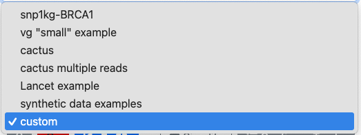
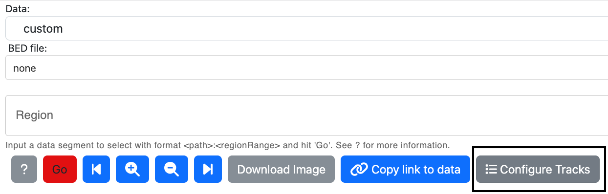
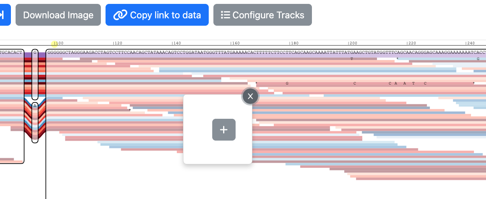
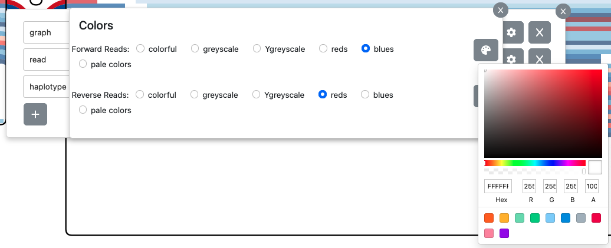
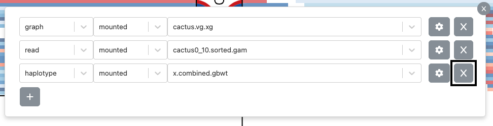
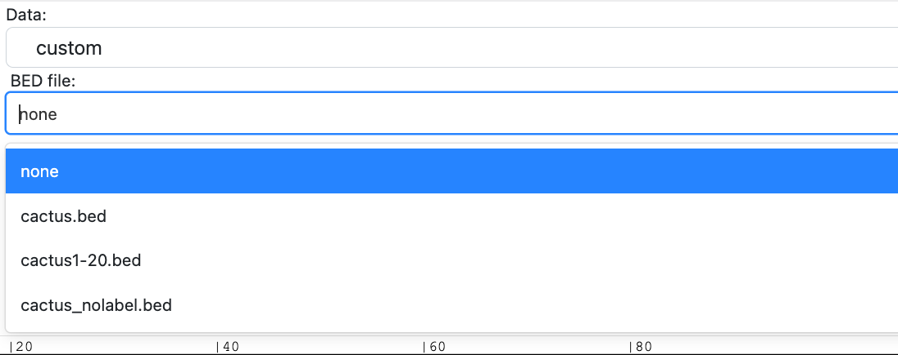
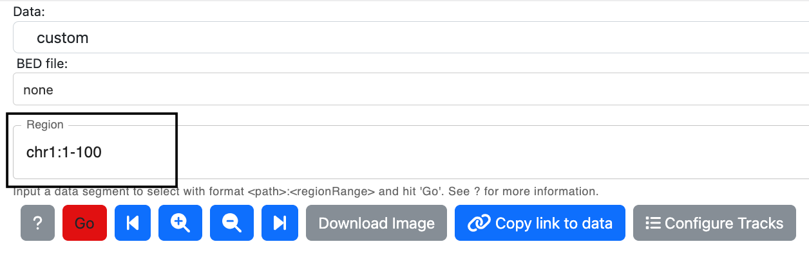
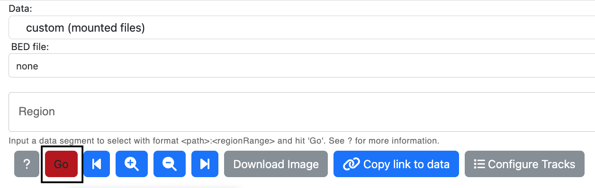

#### Sequence Tube Map Usage Guide
The Sequence Tube Map is used to generate visualizations of genomic sequence graphs. This guide will demonstrate how to select custom data to visualize. [You can also read this guide on Github.](https://github.com/vgteam/sequenceTubeMap/blob/master/public/help/help.md)


##### Selecting Tracks
The following procedure describes adding and updating settings of custom tracks. You can use a custom track to load your own graph file, haplotype database, or file of aligned reads.

1. From the "Data" dropdown box, select "custom (mounted files)"  
  
2. Select the button that says "Configure Tracks".  

3. Once the button is clicked on, a popup with a "+" button will be displayed. Click on this button to add tracks.  
  
4. Select a graph, read, or haplotype track from the first dropdown. Make sure to always have at least 1 graph track. Select a data file from the list of files of that type in the second dropdown.  
  
5. Click on the settings button, where there are options to color the tracks from an existing color palette, or select any other color.  
  
7. To delete a track, click on the button with the "x" icon.  


##### Displaying Visualizations
1. Add as many tracks as needed and exit the track picker. 
2. Add a BED file, if needed. This step is optional.

3. Specify a region input. The region input can be:
   * A coordinate range (e.g. "chr1:1-100")
   * A node ID range (e.g. "node:100-110")
   * A start position and a distance (e.g. "chr1:1+100")
   * A node ID anchor and a distance (e.g. "node:100+10")

4. If simplifying the BED file chunk or graph is possible, users will see a "Simplify Off" button, which when clicked with toggle to "Simplify On". This option enables vg simplify, which would remove small snarls. This option will only appear when there aren't any reads to be displayed. 
5. Click Go to see the selected tracks render in the visualization area.


##### How to make link-to-view URLs
Users can compose URLs that link to a specific view. To do so, users will require specific information about files and tracks. The link has a [query string](https://en.wikipedia.org/wiki/Query_string#Structure) that consists of key-value pairs separated by ampersands, where the keys are not URL-econded and the values are URL-encoded. Keys can use brackets to encode hierarchical structures such as arrays and objects. For arrays, put a number in brackets to assign a new value to or access a value in that entry in the array, and for objects, put the key's name in brackets to assign a new value to or access a value in that entry in the object. The key's name should **not** be in quotes.

These are the fields that can be included in the URL:
1. `tracks` 
Information about tracks. Tracks are objects consisting of trackFile, trackType, and trackColorSettings. To retrieve this information, index the tracks array to access the object and respective keys.

A track JSON object might look like this:
```
{
   "trackFile": "exampleData/internal/snp1kg-BRCA1.vg.xg",
   "trackType": "graph",
   "trackColorSettings": {
      "mainPalette": "greys",
      "auxPalette": "ygreys",
      "colorReadsByMappingQuality": false
   }
}
```

   - The `trackFile` is the path (from the server working directory) or URL (any HTTP/HTTPS URL) to the track file 
     Examples:
      - `exampleData/internal/snp1kg-BRCA1.vg.xg`
      - `https://public.gi.ucsc.edu/~anovak/graphs/trivial-brca1.vg`
   - The `trackType` specifies the type of the track, which can be "graph", "haplotype", "read"
   - The `trackColorSettings` provides color information and is an optional setting.
      - The color palettes are `mainPalette` and `auxPalette`. 
         - The colors for the palettes can be hex codes starting with a `#`, or premade palettes: `greys`, `ygreys`, `blues`, `reds`, `plainColors`, or `lightColors`. 
         - The palettes are used differently for different track types
            - For graphs, the `mainPalette` colors the primary reference path while `auxPalette` is used for the other paths. 
            - For haplotypes, only the `mainPalette` is used. 
            - For reads, the `mainPalette` colors the forward-strand reads and the `auxPalette` colors the backward-strand reads. 
      - `colorReadsByMappingQuality` is a boolean value that determines if reads are colored based on their mapping quality or not. It is an optional field that has a default of `false`. 
   
      Examples 
         - tracks[0][trackColorSettings][mainPalette]=greys
         - tracks[0][trackColorSettings][auxPalette]=ygreys
         - colorReadsByMappingQuality = false   

   
2. `region`
   This is a region input that is documented at
   [Displaying Visualizations](#displaying-visualizations) step 3. This region will be loaded in the tubemap visualization once the link is followed.
   Example: region=17:3A1-100
3. Name of bedfile. Example: exampleData/internal/snp1kg-BRCA1.bed
4. `datatype`
   Describes type of data as `built-in`, `mounted files`, or synthetic `examples`.
      - `built-in`: If the `datatype` field is set to "built-in", the `name` field must be set to the name of a preset defined in `DATA_SOURCES` in `config.json`.
      - `mounted files`: 
      - `examples`: Links to synthetic examples cannot currently be created.
   Example: `dataType=built-in`
5. Simplify, determines whether vg-simplify view is turned on or off.
6. `name` 
   Name of Data. This is a field that indicates the name of preset data, which is defined in `DATA_SOURCES` in `config.json`. `name` is used when `datatype` is set to `built-in`. You do not have to use these presets. Example: `name=snp1kg-BRCA1`


ex: http://127.0.0.1:3001?name=snp1kg-BRCA1&tracks[0][trackFile]=exampleData%2Finternal%2Fsnp1kg-BRCA1.vg.xg&tracks[0][trackType]=graph&tracks[0][trackColorSettings][mainPalette]=greys&tracks[0][trackColorSettings][auxPalette]=ygreys&tracks[1][trackFile]=exampleData%2Finternal%2FNA12878-BRCA1.sorted.gam&tracks[1][trackType]=read&dataPath=default&region=17%3A1-100&bedFile=exampleData%2Finternal%2Fsnp1kg-BRCA1.bed&dataType=built-in&simplify=false

params  name=snp1kg-BRCA1&tracks[0][trackFile]=exampleData%2Finternal%2Fsnp1kg-BRCA1.vg.xg&tracks[0][trackType]=graph&tracks[0][trackColorSettings][mainPalette]=greys&tracks[0][trackColorSettings][auxPalette]=ygreys&tracks[1][trackFile]=exampleData%2Finternal%2FNA12878-BRCA1.sorted.gam&tracks[1][trackType]=read&dataPath=default&region=17%3A1-100&bedFile=exampleData%2Finternal%2Fsnp1kg-BRCA1.bed&dataType=built-in&simplify=false