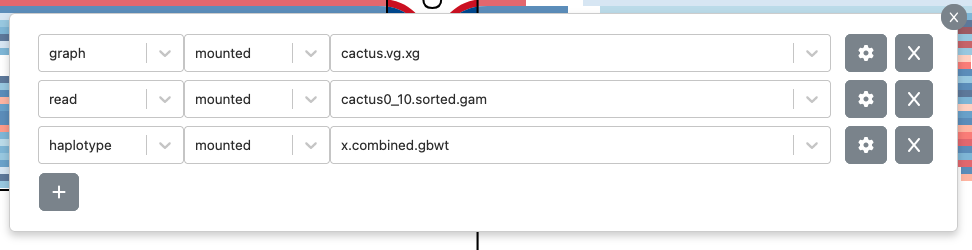
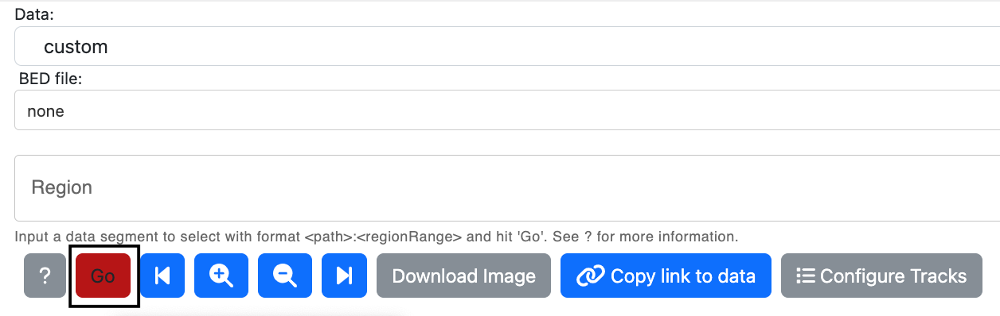

#### Sequence Tube Map Usage Guide
The Sequence Tube Map is used to generate visualizations of genomic sequence graphs. This guide will demonstrate how to select custom data to visualize. [You can also read this guide on Github.](https://github.com/vgteam/sequenceTubeMap/blob/master/public/help/help.md)

##### Selecting Tracks
The following procedure describes adding and updating settings of custom tracks. You can use a custom track to load your own graph file, haplotype database, or file of aligned reads.

1. From the "Data" dropdown box, select "custom (mounted files)"  
  
2. Select the button that says "Configure Tracks".  

3. Once the button is clicked on, a popup with a "+" button will be displayed. Click on this button to add tracks.  
  
4. Select a graph, read, or haplotype track from the first dropdown. Make sure to always have at least 1 graph track. Select a data file from the list of files of that type in the second dropdown.  
  
5. Click on the settings button, where there are options to color the tracks from an existing color palette, or select any other color.  
  
7. To delete a track, click on the button with the "x" icon.  

##### Displaying Visualizations
1. Add as many tracks as needed and exit the track picker. 
2. Add a BED file, if needed. This step is optional.

3. Specify a region input. The region input can be:
   * A coordinate range (e.g. "chr1:1-100")
   * A node ID range (e.g. "node:100-110")
   * A start position and a distance (e.g. "chr1:1+100")
   * A node ID anchor and a distance (e.g. "node:100+10")

4. If simplifying the BED file chunk or graph is possible, users will see a "Simplify Off" button, which when clicked with toggle to "Simplify On". This option enables vg simplify, which would remove small snarls. This option will only appear when there aren't any reads to be displayed. 
5. Click Go to see the selected tracks render in the visualization area.

##### How to make link-to-view URLs
Users can compose URLs that link to a specific view. To do so, users will require specific information about files and tracks.

1. Name of Data. Example: name=snp1kg-BRCA1
2. Information about tracks. Tracks are objects consisting of trackFile, trackType, and trackColorSettings. To retrieve this information, index the tracks array to access the object and respective keys.
   - trackFile: name of track file
     Example: tracks[0][trackFile]=exampleData%2Finternal%2Fsnp1kg-BRCA1.vg.xg
   - trackType: type of track, can be "graph," "haplotype," "read," or "bed"
     Example: tracks[0][trackType]=graph
   - trackColorSettings: color settings for Main and Aux Palettes. It has default values, so it does not required to be user-specified.   
     Example: tracks[0][trackColorSettings][mainPalette]=greys
         tracks[0][trackColorSettings][auxPalette]=ygreys
         colorReadsByMappingQuality = Boolean
3. Region input, Example: region=17%3A1-100
4. DataPath: Types of datapaths, can be "mounted," "default," or "upload". Example: dataPath=default
5. BedFile: Name of bedfile, ex: bedFile=exampleData%2Finternal%2Fsnp1kg-BRCA1.bed
6. dataType: Describes type of data as "built-in", "file-upload," "mounted files", or synthetic "examples", Example: dataType=built-in
7. Simplify, determines whether vg-simplify view is turned on or off. Example: simplify=false

ex: http://127.0.0.1:3001?name=snp1kg-BRCA1&tracks[0][trackFile]=exampleData%2Finternal%2Fsnp1kg-BRCA1.vg.xg&tracks[0][trackType]=graph&tracks[0][trackColorSettings][mainPalette]=greys&tracks[0][trackColorSettings][auxPalette]=ygreys&tracks[1][trackFile]=exampleData%2Finternal%2FNA12878-BRCA1.sorted.gam&tracks[1][trackType]=read&dataPath=default&region=17%3A1-100&bedFile=exampleData%2Finternal%2Fsnp1kg-BRCA1.bed&dataType=built-in&simplify=false

params  name=snp1kg-BRCA1&tracks[0][trackFile]=exampleData%2Finternal%2Fsnp1kg-BRCA1.vg.xg&tracks[0][trackType]=graph&tracks[0][trackColorSettings][mainPalette]=greys&tracks[0][trackColorSettings][auxPalette]=ygreys&tracks[1][trackFile]=exampleData%2Finternal%2FNA12878-BRCA1.sorted.gam&tracks[1][trackType]=read&dataPath=default&region=17%3A1-100&bedFile=exampleData%2Finternal%2Fsnp1kg-BRCA1.bed&dataType=built-in&simplify=false

URL to a region consists of:

name: name=snp1kg-BRCA1 (name of data)
tracks:
   - trackFile: 
      tracks[0][trackFile]=exampleData%2Finternal%2Fsnp1kg-BRCA1.vg.xg
      tracks[1][trackFile]=exampleData%2Finternal%2FNA12878-BRCA1.sorted.gam
   - trackType: 
      tracks[0][trackType]=graph
      tracks[1][trackType]=read
   - trackColorSettings: 
      - mainPalette
      tracks[0][trackColorSettings][mainPalette]=greys
      - auxPalette
      tracks[0][trackColorSettings][auxPalette]=ygreys
      - colorReadsByMappingQuality
region: region=17%3A1-100
dataPath: dataPath=default
bedFile: bedFile=exampleData%2Finternal%2Fsnp1kg-BRCA1.bed
dataType: dataType=built-in
simplify: simplify=false

separated by '?'
%2F: '/'